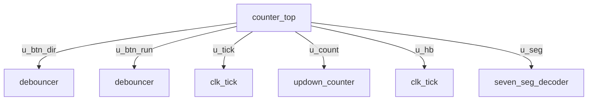

# counter

Generated by WEFT 0.5.0 from the project's sources, constraints and reports. Regenerate it rather than editing it.

## Overview

|  |  |
|---|---|
| Revision | counter |
| Top entity | counter_top |
| Family | MAX 10 |
| Device | 10M04SAE144A7G |
| sdc sources | 1 |
| systemverilog sources | 3 |
| verilog sources | 1 |
| vhdl sources | 1 |

## Hierarchy

## Modules

| Module | Language | Summary | File |
|---|---|---|---|
| clk_tick | verilog | clock divider emitting a one-cycle tick at TICK_HZ | counter/src/clk_tick.v |
| counter_top | systemverilog | eight-bit demonstration counter driving LEDs and a display | counter/src/counter_top.sv |
| counter_top_tb | systemverilog | drives the whole design through its button sequences | counter/tb/counter_top_tb.sv |
| debouncer | systemverilog | input synchroniser, contact debouncer and edge detector | counter/src/debouncer.sv |
| seven_seg_decoder | vhdl | hexadecimal digit to seven-segment patterns | counter/src/seven_seg_decoder.vhd |
| seven_seg_decoder_tb | vhdl | checks all sixteen patterns and the blank input | counter/tb/seven_seg_decoder_tb.vhd |
| updown_counter | systemverilog | up/down counter with enable and synchronous clear | counter/src/updown_counter.sv |
| updown_counter_tb | systemverilog | checks counting, direction, enable and clear | counter/tb/updown_counter_tb.sv |

## Clocks

| Clock | Period (ns) | Frequency (MHz) | Target | Source |
|---|---|---|---|---|
| clk | 20 | 50 | clk | counter.sdc |

## Pin map

20 of 20 signals were placed by the fitter rather than constrained; those locations change whenever the design is refitted.

| Signal | Pin | Direction | I/O standard | Bank | Assigned |
|---|---|---|---|---|---|
| btn_n[0] | 132 | input | 2.5 V | 8 | no |
| btn_n[1] | 131 | input | 2.5 V | 8 | no |
| clk | 28 | input | 2.5 V | 2 | no |
| heartbeat | 24 | output | 2.5 V | 1B | no |
| led[0] | 55 | output | 2.5 V | 3 | no |
| led[1] | 57 | output | 2.5 V | 3 | no |
| led[2] | 60 | output | 2.5 V | 3 | no |
| led[3] | 62 | output | 2.5 V | 4 | no |
| led[4] | 59 | output | 2.5 V | 3 | no |
| led[5] | 54 | output | 2.5 V | 3 | no |
| led[6] | 56 | output | 2.5 V | 3 | no |
| led[7] | 58 | output | 2.5 V | 3 | no |
| rst_n | 29 | input | 2.5 V | 2 | no |
| seg_n[0] | 80 | output | 2.5 V | 5 | no |
| seg_n[1] | 75 | output | 2.5 V | 5 | no |
| seg_n[2] | 61 | output | 2.5 V | 4 | no |
| seg_n[3] | 77 | output | 2.5 V | 5 | no |
| seg_n[4] | 66 | output | 2.5 V | 4 | no |
| seg_n[5] | 64 | output | 2.5 V | 4 | no |
| seg_n[6] | 70 | output | 2.5 V | 4 | no |

## Compilation results

Status: Successful - Sat Aug 22 17:58:59 2026

### Resources

| Resource | Used | Available | % |
|---|---|---|---|
| logic_elements | 177 | 4032 | 4 |
| combinational_functions | 173 | 4032 | 4 |
| registers | 108 | 4032 | 3 |
| registers_total | 108 | - | - |
| pins | 20 | 101 | 20 |
| virtual_pins | 0 | - | - |
| memory_bits | 0 | 193536 | 0 |
| multipliers | 0 | 40 | 0 |
| plls | 0 | 1 | 0 |

### Timing

| Clock | Fmax (MHz) | Restricted Fmax (MHz) | Worst slack (ns) | Met |
|---|---|---|---|---|
| clk | 154.23 | 154.23 | 0.144 | yes |

6 warnings and errors were reported; parse_reports returns them ranked.
